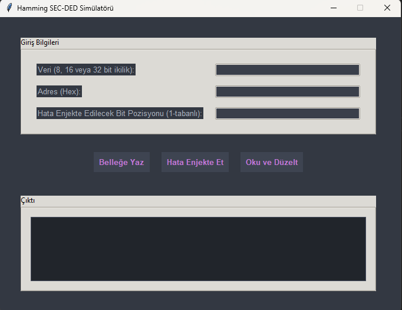

# 🧮 Hamming SEC-DED Simülatörü

Bu proje, **Hamming Tek Hata Düzeltme ve Çift Hata Tespit (SEC-DED)** kodlama algoritmasını görsel bir arayüz ile simüle eden bir Python uygulamasıdır. Kullanıcılar, 8, 16 ve 32 bitlik ikilik veriler üzerinde kodlama, hata enjeksiyonu ve düzeltme işlemlerini interaktif olarak deneyimleyebilir.

## 🚀 Özellikler

- **🔢 Dinamik Hamming Kodlama:**  
  8, 16 ve 32 bit uzunluğundaki ikilik veriler için otomatik olarak SEC-DED kodu oluşturur.

- **💾 Bellek Simülasyonu:**  
  Veriler, basit bir bellek yapısında heksadesimal adreslere yazılır ve buradan okunabilir.

- **⚠️ Yapay Hata Enjeksiyonu:**  
  Belirli bir bit pozisyonuna tek bitlik hata (bit flip) enjekte etme imkanı sunar.

- **🔍 Hata Tespiti ve Düzeltme:**  
  Sendrom analizi ve global parite yardımıyla tek bit hataları otomatik düzeltir, çift bit hataları kullanıcıya bildirir.

- **🖥️ Kullanıcı Dostu Arayüz:**  
  Modern, karanlık tema destekli, `tkinter.ttk` tabanlı grafiksel kullanıcı arayüzü.

---

## 🛠️ Kurulum ve Çalıştırma

### 🔧 Gereksinimler
- Python 3.x  
- `tkinter` (çoğu Python dağıtımıyla birlikte gelir. Eksikse: `pip install tk`)

### 📁 Dosyaları İndirme
Tüm dosyaları aynı dizine yerleştirin:
- `main.py`
- `hamming.py`
- `memory.py`
- `utils.py`

### ▶️ Uygulamayı Başlatma

1. Terminal veya komut istemcisini açın.
2. Proje klasörüne gidin:

```bash
cd hamming_sec_ded_code_simulator
```

3. Uygulamayı başlatmak için şu komutu çalıştırın:

```bash
python main.py
```

> Not: Python 3 kurulu değilse `python3 main.py` komutu da çalışabilir.

---

## 🧪 Kullanım

1. **Veri Yazma**  
   - "Veri" alanına 8, 16 veya 32 bitlik ikilik bir değer girin (örn. `10110011` veya `1100110011001100`)
   - "Adres" alanına bir heksadesimal adres girin (örn. `A0`)
   - "Belleğe Yaz" butonuna tıklayın

2. **Hata Enjekte Etme**  
   - "Hata Enjekte Edilecek Bit Pozisyonu" alanına 1-tabanlı bir bit pozisyonu girin (örn. `5`)
   - "Hata Enjekte Et" butonuna tıklayın

3. **Oku ve Düzelt**  
   - "Adres" alanına, veri yazılmış bir adres girin
   - "Oku ve Düzelt" butonuna tıklayın
   - Uygulama, veriyi okuyup hata tespiti ve gerekirse düzeltme işlemlerini yaparak sonucu çıktı alanında gösterecektir

---

## 🖼️ Örnek Ekran Görüntüsü



---

## 🎬 Demo Videosu

> [🔗 YouTube Demo Videosu](https://www.youtube.com/watch?v=SvGL_m1ajHU)  

---

## 🔮 Gelecekteki Geliştirmeler

- 64-bit ve üzeri veri blokları için destek  
- Bellek haritasının görsel olarak gösterimi  
- Rastgele hata üretimi ile gelişmiş simülasyon  
- Performans ve hata analizi için raporlama

---

## 👨‍💻 Geliştirici

**Ahmet Güldaş**  
> Bu uygulama akademik ve öğretici amaçla geliştirilmiştir.  
> Geri bildirim ve katkılarınız için teşekkürler!
